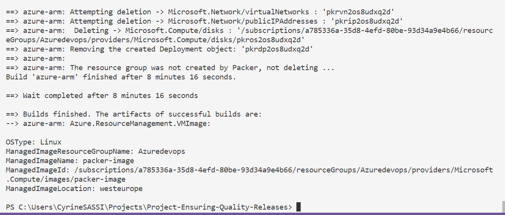
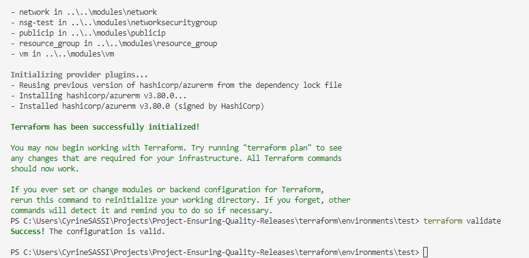
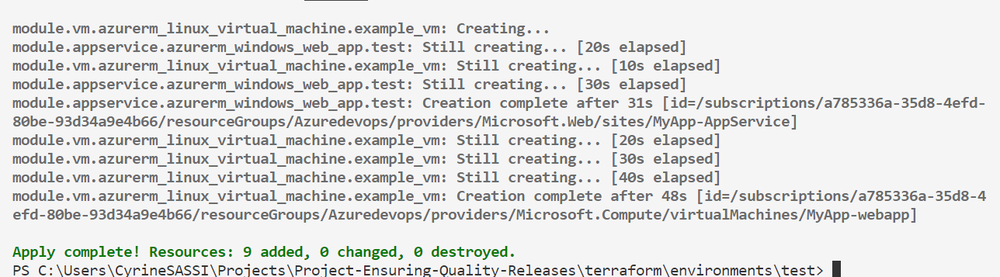
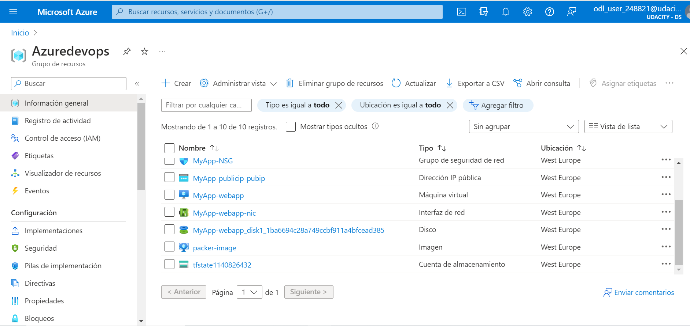
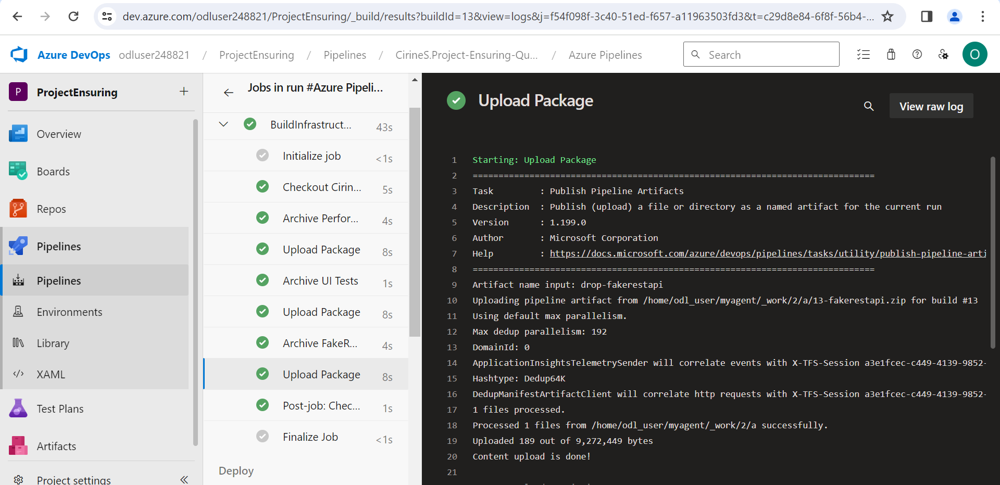
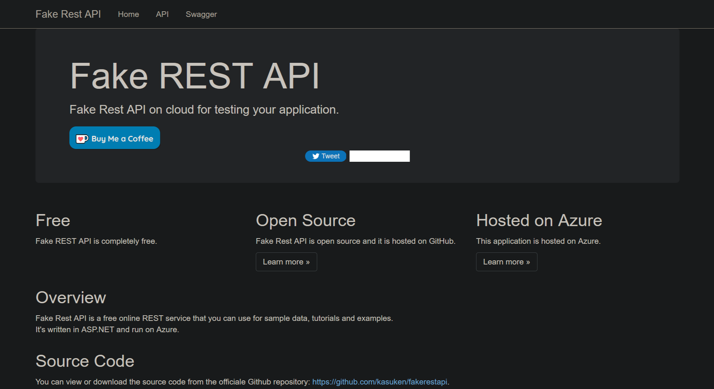
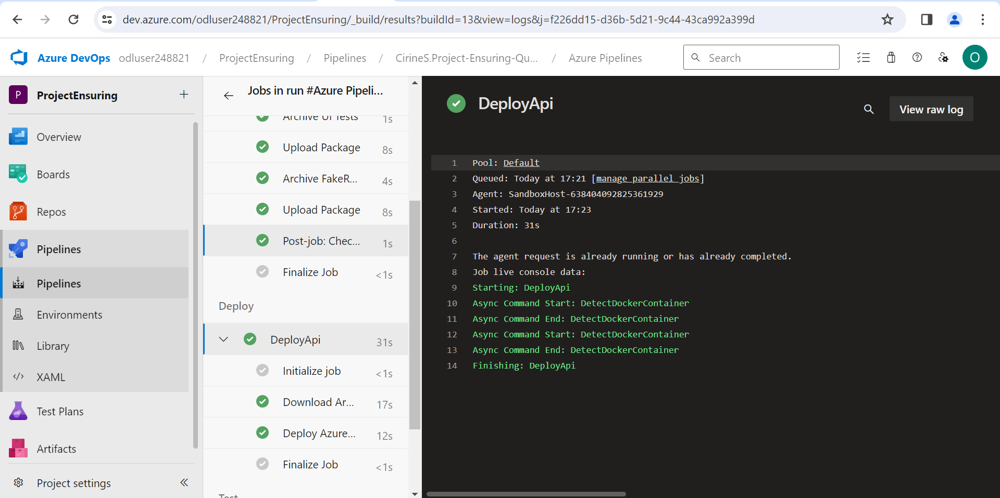
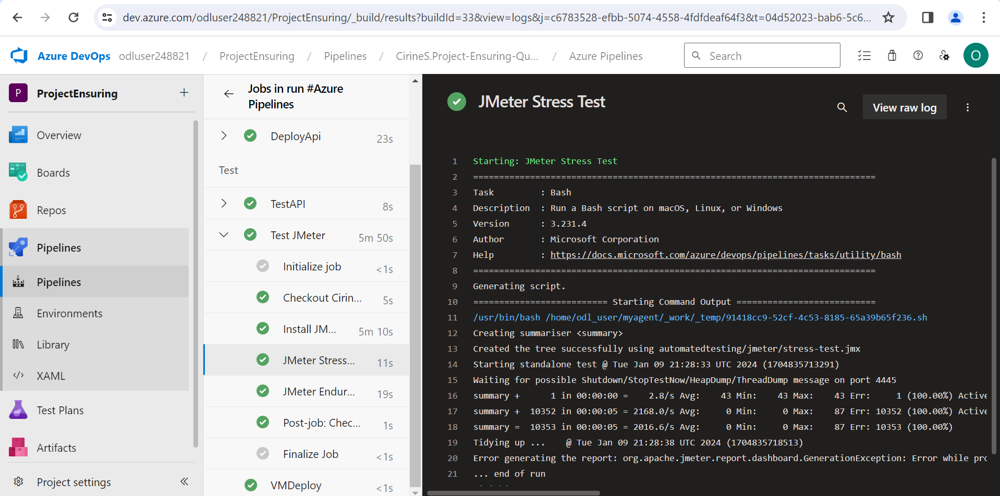
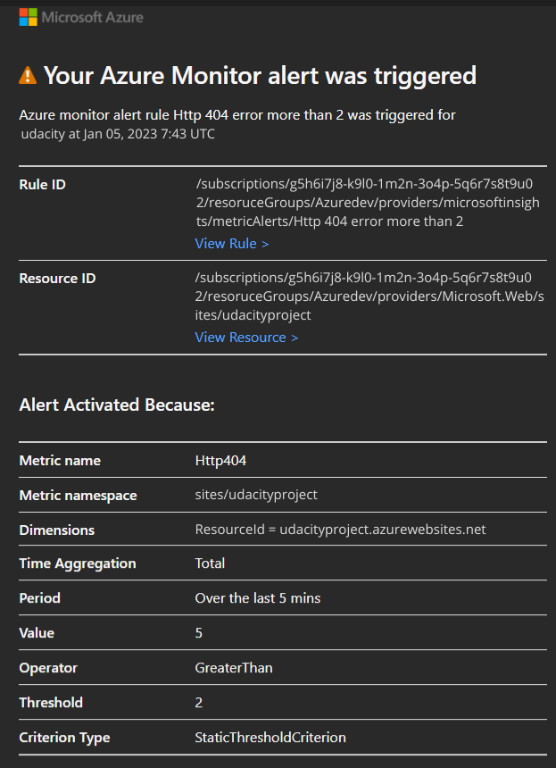

# Ensuring Quality Releases - Project

This project focuses on leveraging industry-leading tools, particularly Microsoft Azure, to establish a robust pipeline for creating disposable test environments, running automated tests effortlessly, and ensuring the quality of software releases.

## Overview

### Pipeline Resources

This CI/CD pipeline will generate the following essential resources:

* Resource Group
* App Service
* Virtual Network
* Network Security Group
* Virtual Machine

These resources are orchestrated to deploy a demo REST API within the App Service, while comprehensive automated tests are executed against the REST API from a virtual machine created using Terraform in the CI/CD pipeline.

### Tests

The pipeline includes automated tests developed using 
* *Postman* for API Testing (Integration Testing)
* *JMeter* for Performance Testing
* *Selenium* using Chromedriver for Functional UI Testing

The final pipeline, described in the *azure-pipelines.yaml* file, guides you through integrating these tests seamlessly.

## Set up

## Dependencies

The following are the dependencies of the project you will need:

- Install the following tools:
  - [Azure CLI](https://docs.microsoft.com/en-us/cli/azure/install-azure-cli?view=azure-cli-latest)
  - [Terraform](https://www.terraform.io/downloads.html)
  - [JMeter](https://jmeter.apache.org/download_jmeter.cgi)
  - [Postman](https://www.postman.com/downloads/)
  - [Python](https://www.python.org/downloads/)
  - [Selenium](https://www.selenium.dev/)
  - [Chromedriver](https://chromedriver.chromium.org/)
  - [Chrome](https://www.google.com/intl/de_de/chrome/)

In [Azure DevOps](https://dev.azure.com), you also need to install this dependencies:
* [Terraform](https://marketplace.visualstudio.com/items?itemName=ms-devlabs.custom-terraform-tasks)
* [Jmeter tasks](https://marketplace.visualstudio.com/items?itemName=AlexandreGattiker.jmeter-tasks)
* [PublishHTMLReports](https://marketplace.visualstudio.com/items?itemName=LakshayKaushik.PublishHTMLReports)

## Instructions

### Login with Azure CLI

First, login to the Azure CLI using:

```bash
az login
```

In Azure, you need to create a resource group that takes all resources build for this project. For the project, I have used *Azuredevops*.

## Run Packer image for VM

To provide the image for the VM, we will create with Terraform, there must be image specified. First, you need to update the variables defined in *packer-image.json*:

```json
    "variables": {
        "subscription_id": "...",
        "tenant_id": "...",
        "client_id": "...",
        "client_secret": "...",   
        "resource_group_name": "...", # e.g. Azuredevops
        "image_name": "packer-image",
        "vm_size": "..."
    }
```

Once the variables have been provided, the image for the VM will be then created with running 
```cmd
packer build ./packer-image.json
```

If you want to retrieve the information from that image after the creation again, you can run 
*get_imageid.sh* at terraform/environments/test/. Make sure to update the credentials inside of the file:

```bash
subscription_id="..."
resource_group="..." # e.g. Azuredevops
image_name="packer-image"
```



### Configure the storage account and state backend

Firstly, execute the `configure-tfstate-storage-account.sh` script:

```bash
bash configure-tfstate-storage-account.sh
```
Be aware that this creates the tf storage specified in the file as
```bash
RESOURCE_GROUP_NAME="..." # e.g. Azuredevops
```

This will create a storage in the resource group saving the *tfstate* and provide relevant information for setting up the Terraform files, e.g. an access key for the storage.

After that, update `terraform/main.tf` with the Terraform storage account and state backend configuration variables:

- `storage_account_name`: The name of the Azure Storage account
- `container_name`: The name of the blob container
- `key`: The name of the state store file to be created

```bash
terraform {
  backend "azurerm" {
    storage_account_name = "tfstate..." # number of created tf storage
    container_name       = "tfstate" 
    key                  = "test.terraform.tfstate"
    access_key           = "..." # access key provided by the created tf storage
  }
}
```

If you want to retrieve the access key from that image after the creation again, you can run 
*get_key.sh* at terraform/environments/test/. Make sure to update the credentials inside of the file:
```bash
STORAGE_ACCOUNT_NAME="tfstate..." # insert number of created tf storage
RESOURCE_GROUP="... " # e.g. Azuredevops
```

### Configuring Terraform

Update the following values in `terraform.tfvars` as required:

```bash
# Azure subscription vars
subscription_id = "..." # service principal id
tenant_id = "..."
client_id = "..." # application id
client_secret = "..." # secret key

# Resource Group/Location
location = "..." # location where the resource group is located at
resource_group = "..." # e.g. Azuredevops
application_type = "..."

# Network
virtual_network_name = "..."
address_space = ["..."]
address_prefix_test = "..."

# VM
vm_admin_username = "..."
packer_image = "/subscriptions/.../resourceGroups/Azuredevops/providers/Microsoft.Compute/images/packer-image" # provide the same resource group as above (VM uses this image)
```

Also, generate an SSH key pair in the Azure command shell on https://portal.azure.com
```bash
ssh-keygen -t rsa
cat ~/.ssh/id_rsa.pub
```
Provide this key in terraform/modules/vm for *vm.tf*:
```bash
  admin_ssh_key {
    username   = var.vm_admin_username
    public_key = "..." # starts with "ssh-rsa"
  }
```

### Executing Terraform

Terraform creates the following resources for a specific environment tier:

- App Service
- App Service Plan
- Network
- Network Security Group
- Public IP
- Resource Group
- VM (uses the packer image provided)

The CD pipeline will run these commands in terraform/environments/test to create the infrastructure:

```bash
terraform init
terraform validate
terraform apply
```

 


Once done, the resource group should look like this:




### Setting up Azure DevOps

### Create a Service Principal for Terraform

A Service Principal is an application within Azure Active Directory whose authentication tokens can be used as the `client_id`, `client_secret`, and `tenant_id` fields needed by Terraform (`subscription_id` can be independently recovered from your Azure account details). See [Azure Provider: Authenticating using a Service Principal with a Client Secret](https://registry.terraform.io/providers/hashicorp/azurerm/latest/docs/guides/service_principal_client_secret) for details

 In Azure Pipelines, you can run parallel jobs on Microsoft-hosted infrastructure or your own (self-hosted) infrastructure. For this project, I have set up a self-hosted agent. Go to https://dev.azure.com and do following steps:
 * Create a new project.
 * Create a personal access token (PAT) in Azure DevOps and copy that PAT locally on your PC. you will need this to set up your agent on the VM for the "Build" step.
 * Set up a service connection named `myServiceConnection` with access to all pipelines (Project -> Project settings).
 * Create an agent pool with access to all pipelines. Add an agent automatically with the Azure resource manager. Add this agent to a new VM in the same resource group. This VM will run the "Build" step.
 * Create a new environment `test` (Azure Pipelines -> Environments) and provide it to another new VM in the same resource group. This VM will run the "Deploy" and "Test" parts.
 * Create a new pipeline. Select GitHub and then your GitHub repository. Configure your pipeline by choosing "Existing Azure Pipelines YAML File" and select the `azure-pipelines.yaml` file in the menu that pops out on the right.

On the Review page, update the Terraform variables:

```yaml
variables:
  python.version: '...' # Python version the VMs are running on
  azureServiceConnectionId: 'myServiceConnection'
  projectRoot: $(System.DefaultWorkingDirectory)
  environmentName: 'test-vm'
  tfstatenumber: 'tfstate...' # number of created tf storage
  tfrg: '...' # resource group for all files
  application_type: '...'  # name of the project given in dev.azure.com
```

Once the pipeline will run the "Build" step, it will build the infrastructure:


### Deploy

When having run the pipeline up to the "Deploy" step, the FakeRestAPI will be deployed as an app service at URL defined at terraform/modules/appservice in *appservice.tf*:
```bash
name = "${var.application_type}-${var.resource_type}"
```

So if you use for instance 
```bash
application_type = "MyApp"
```

the web app will be named `MyApp-Appservice` and will be hosted at https://myapp-appservice.azurewebsites.net

When opening this URL after deployment, it will look like the following:





### Automated testing




## Monitoring and Observability

- Go to the Azure Portal and create a new alert in the monitoring group, then execute the pipeline to trigger an alert

Monitor chart


Trigger email alert



- Configure azure log analytics by downloading the selenium-test.log artifact from Azure Devops
- Navigate to the Azure Portal and access Azure Log Analytics workspaces. Configure an agent on the virtual machine where the Selenium testing will take place. Ensure the VM is connected to Log Analytics and establish a Data Collection Rule to capture the necessary logs.
- Navigate to the Logs section and initiate the creation of a custom log. Import the file named selenium-test.log. Choose "Timestamp" with the format YYYY-MM-DD HH:MM:SS as the record separator. Specify the path of the selenium-test.log from the VM where the task was executed as the collection path for logs (please note that there might be a delay before the VM can start collecting logs).

#### Querying custom logs

- Then go to logs in general group of your log analytics, select your custom log and run it


## Clean-up

Destroy the Terraform resources:

```bash
cd terraform
terraform destroy
```